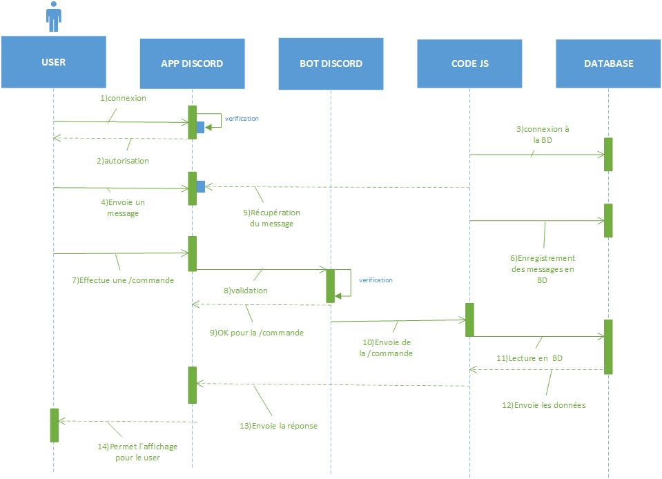
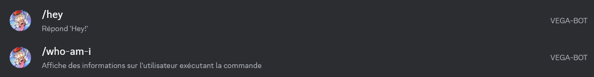
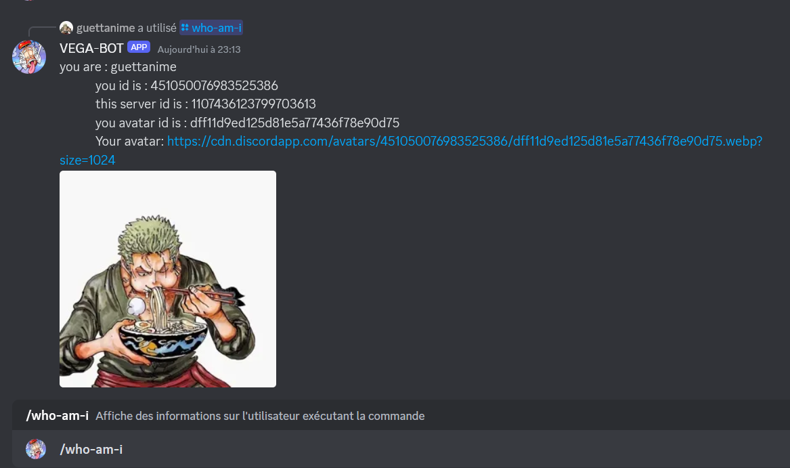
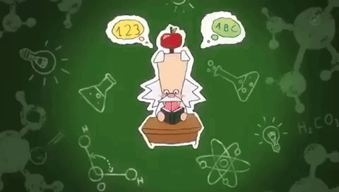
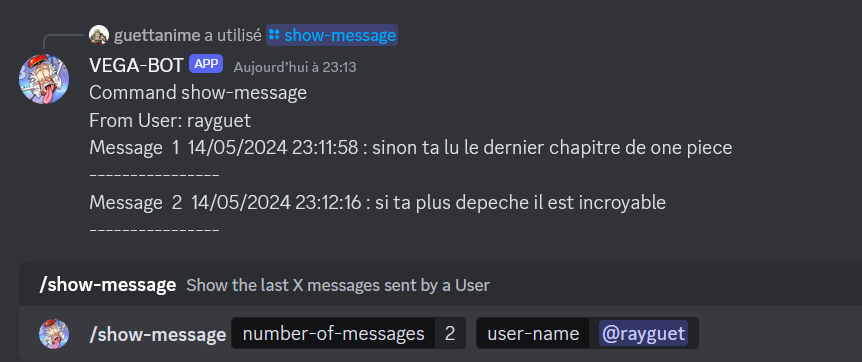
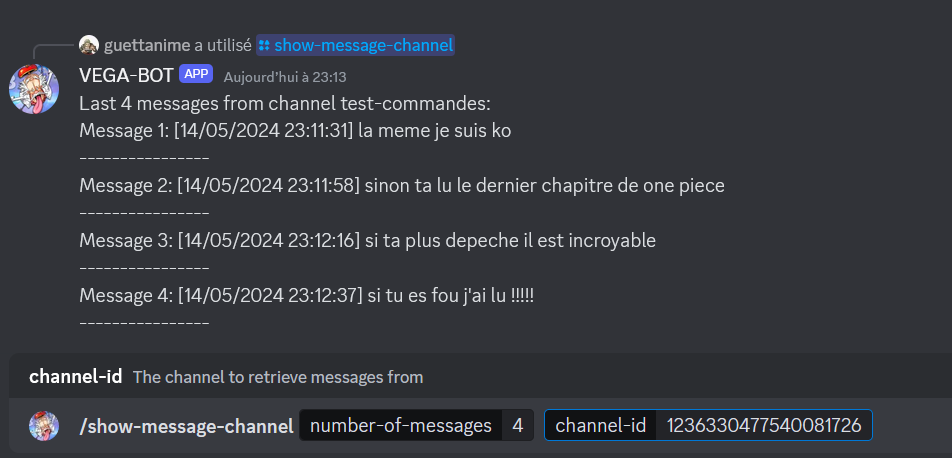
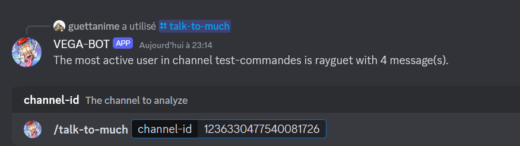

# Présentation du Vega-Bot🤖

## Sommaire
- [I. Conception et SQL](#i-conception-et-sql)
  - [a. MCD](#a-mcd)
  - [b. MLD](#b-mld)
  - [c. MPD](#c-mpd)
  - [d. Diagramme de séquence](#d-diagramme-de-séquence)
- [II. Bot Discord](#ii-bot-discord)
  - [a. Commandes simples](#a-commandes-simples)
  - [b. Commande en relation avec la base de données](#b-commande-en-relation-avec-la-base-de-données)

## I. Conception et SQL

### a. MCD
La conception du Modèle Conceptuel de Données (MCD) pour le Vega-Bot comprend les entités principales et leurs relations.

### b. MLD
Le Modèle Logique de Données (MLD) traduit le MCD en un schéma logique adapté à un système de gestion de base de données relationnelle.

### c. MPD
Le Modèle Physique de Données (MPD) détaille la structure de stockage des données sur le support physique.

### d. Diagramme de séquence
Le diagramme de séquence ci dessous nous permet de montrer l'interaction entre les différentes entités du système au fil du temps.

## II. Bot Discord

### a. Commandes simples
Le Vega-Bot inclut plusieurs commandes simples pour interagir avec les utilisateurs sur Discord.
Dans un premier temps le but est que le bot réalise une commande /hey et /who-am-i.

La commande /hey a juste pour objectif d'obtenir une réponse 'Hey!' de la part du bot.

Concernant la commande /who-am-i, le but est que le bot affiche les infos de l'utilisateur.

### b. Commande en relation avec la base de données
Certaines commandes du Vega-Bot interagissent directement avec la base de données pour récupérer ou mettre à jour des informations.
Les commandes réalisées ci-dessous étaient plus complexes que les deux premières en raison de la logique à avoir avec la connexion à la base de données, car il y a tout un travail dans un premier temps d'insertion à la base de données puis de lecture dans cette dernière afin que le bot puisse retranscrire les infos demandées sur le Discord.

La commande /show-message a pour but d'afficher un nombre choisi de derniers messages envoyés par un utilisateur du canal.

La commande /show-message-channel a pour but d'afficher un nombre choisi des derniers messages envoyés par tous les utilisateurs d'un canal sélectionné, en fonction de son ID.

La commande /talk-too-much permet d'afficher le nombre de messages de l'utilisateur ayant été le plus actif, c'est-à-dire celui qui a envoyé le plus de messages dans un canal choisi via son ID.

---

