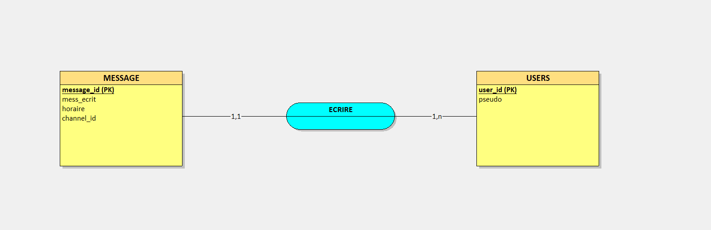
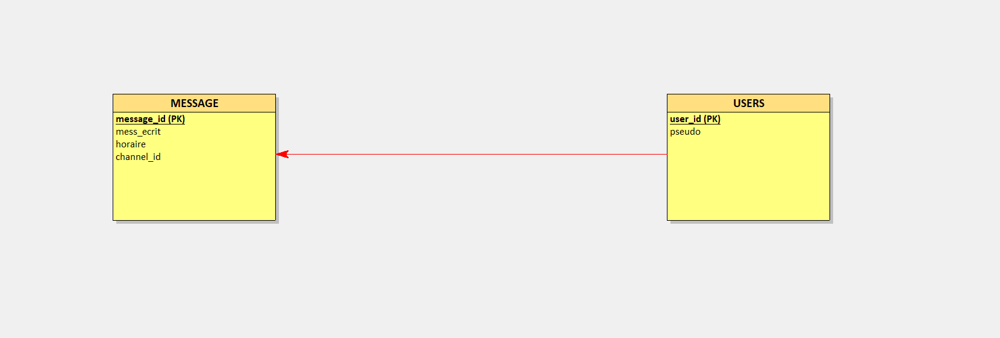
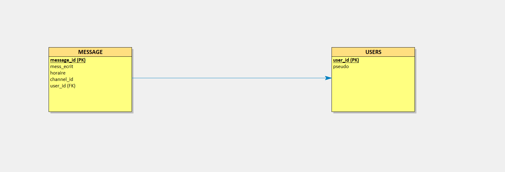

# Présentation du Vega-Bot

## Sommaire
- [I. Conception et SQL](#i-conception-et-sql)
  - [a. MCD](#a-mcd)
  - [b. MLD](#b-mld)
  - [c. MPD](#c-mpd)
  - [d. Diagramme de séquence](#d-diagramme-de-séquence)
- [II. Bot Discord](#ii-bot-discord)
  - [a. Commandes simples](#a-commandes-simples)
  - [b. Commande en relation avec la base de données](#b-commande-en-relation-avec-la-base-de-données)

## I. Conception et SQL

### a. MCD
La conception du Modèle Conceptuel de Données (MCD) pour le Vega-Bot comprend les entités principales et leurs relations.

### b. MLD
Le Modèle Logique de Données (MLD) traduit le MCD en un schéma logique adapté à un système de gestion de base de données relationnelle.

### c. MPD
Le Modèle Physique de Données (MPD) détaille la structure de stockage des données sur le support physique.

### d. Diagramme de séquence
Le diagramme de séquence montre l'interaction entre les différentes entités du système au fil du temps.

## II. Bot Discord

### a. Commandes simples
Le Vega-Bot inclut plusieurs commandes simples pour interagir avec les utilisateurs sur Discord.

### b. Commande en relation avec la base de données
Certaines commandes du Vega-Bot interagissent directement avec la base de données pour récupérer ou mettre à jour des informations.

---

Pour plus de détails techniques et des exemples de commandes, veuillez consulter les sections spécifiques ci-dessus.
